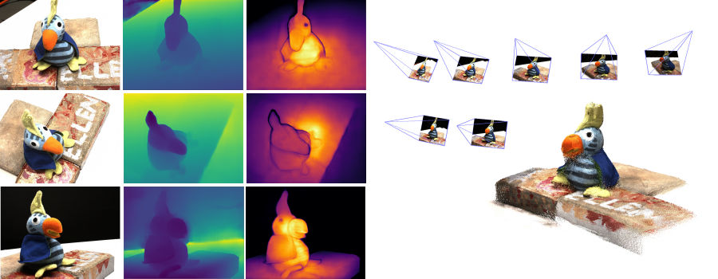
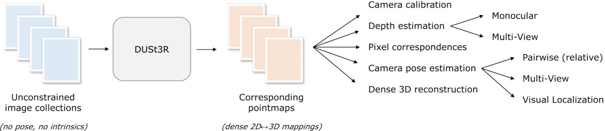
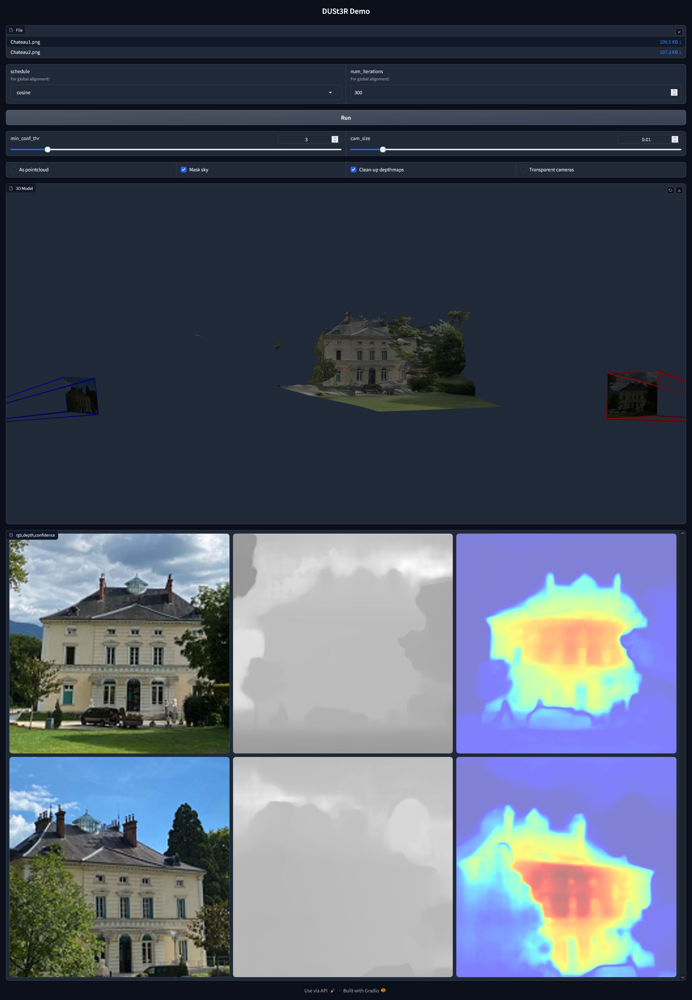
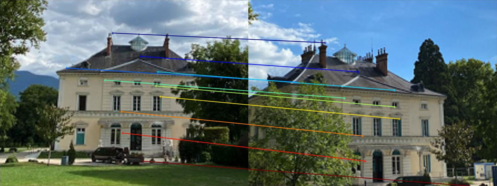

Official implementation of `DUSt3R: Geometric 3D Vision Made Easy`  
[[Project page](https://dust3r.europe.naverlabs.com/)], [[DUSt3R arxiv](https://arxiv.org/abs/2312.14132)]  

> Make sure to also check our other works:  
> [Grounding Image Matching in 3D with MASt3R](https://github.com/naver/mast3r): DUSt3R with a local feature head, metric pointmaps, and a more scalable global alignment!  
> [Pow3R: Empowering Unconstrained 3D Reconstruction with Camera and Scene Priors](https://github.com/naver/pow3r): DUSt3R with known depth / focal length / poses.  
> [MUSt3R: Multi-view Network for Stereo 3D Reconstruction](https://github.com/naver/must3r): Multi-view predictions (RGB SLAM/SfM) without any global alignment.    





```bibtex
@inproceedings{dust3r_cvpr24,
      title={DUSt3R: Geometric 3D Vision Made Easy}, 
      author={Shuzhe Wang and Vincent Leroy and Yohann Cabon and Boris Chidlovskii and Jerome Revaud},
      booktitle = {CVPR},
      year = {2024}
}

@misc{dust3r_arxiv23,
      title={DUSt3R: Geometric 3D Vision Made Easy}, 
      author={Shuzhe Wang and Vincent Leroy and Yohann Cabon and Boris Chidlovskii and Jerome Revaud},
      year={2023},
      eprint={2312.14132},
      archivePrefix={arXiv},
      primaryClass={cs.CV}
}
```

## Table of Contents

- [Table of Contents](#table-of-contents)
- [License](#license)
- [Get Started](#get-started)
  - [Installation](#installation)
  - [Checkpoints](#checkpoints)
  - [Interactive demo](#interactive-demo)
  - [Interactive demo with docker](#interactive-demo-with-docker)
- [Usage](#usage)
- [Training](#training)
  - [Datasets](#datasets)
  - [Demo](#demo)
  - [Our Hyperparameters](#our-hyperparameters)

## License

The code is distributed under the CC BY-NC-SA 4.0 License.
See [LICENSE](LICENSE) for more information.

```python
# Copyright (C) 2024-present Naver Corporation. All rights reserved.
# Licensed under CC BY-NC-SA 4.0 (non-commercial use only).
```

## Get Started

### Installation

1. Clone DUSt3R.
```bash
git clone --recursive https://github.com/naver/dust3r
cd dust3r
# if you have already cloned dust3r:
# git submodule update --init --recursive
```

2. Create the environment, here we show an example using conda.
```bash
conda create -n dust3r python=3.11 cmake=3.14.0
conda activate dust3r 
conda install pytorch torchvision pytorch-cuda=12.1 -c pytorch -c nvidia  # use the correct version of cuda for your system
pip install -r requirements.txt
# Optional: you can also install additional packages to:
# - add support for HEIC images
# - add pyrender, used to render depthmap in some datasets preprocessing
# - add required packages for visloc.py
pip install -r requirements_optional.txt
```

3. Optional, compile the cuda kernels for RoPE (as in CroCo v2).
```bash
# DUST3R relies on RoPE positional embeddings for which you can compile some cuda kernels for faster runtime.
cd croco/models/curope/
python setup.py build_ext --inplace
cd ../../../
```

### Checkpoints

You can obtain the checkpoints by two ways:

1) You can use our huggingface_hub integration: the models will be downloaded automatically.

2) Otherwise, We provide several pre-trained models:

| Modelname   | Training resolutions | Head | Encoder | Decoder |
|-------------|----------------------|------|---------|---------|
| [`DUSt3R_ViTLarge_BaseDecoder_224_linear.pth`](https://download.europe.naverlabs.com/ComputerVision/DUSt3R/DUSt3R_ViTLarge_BaseDecoder_224_linear.pth) | 224x224 | Linear | ViT-L | ViT-B |
| [`DUSt3R_ViTLarge_BaseDecoder_512_linear.pth`](https://download.europe.naverlabs.com/ComputerVision/DUSt3R/DUSt3R_ViTLarge_BaseDecoder_512_linear.pth)   | 512x384, 512x336, 512x288, 512x256, 512x160 | Linear | ViT-L | ViT-B |
| [`DUSt3R_ViTLarge_BaseDecoder_512_dpt.pth`](https://download.europe.naverlabs.com/ComputerVision/DUSt3R/DUSt3R_ViTLarge_BaseDecoder_512_dpt.pth) | 512x384, 512x336, 512x288, 512x256, 512x160 | DPT | ViT-L | ViT-B |

You can check the hyperparameters we used to train these models in the [section: Our Hyperparameters](#our-hyperparameters)

To download a specific model, for example `DUSt3R_ViTLarge_BaseDecoder_512_dpt.pth`:
```bash
mkdir -p checkpoints/
wget https://download.europe.naverlabs.com/ComputerVision/DUSt3R/DUSt3R_ViTLarge_BaseDecoder_512_dpt.pth -P checkpoints/
```

For the checkpoints, make sure to agree to the license of all the public training datasets and base checkpoints we used, in addition to CC-BY-NC-SA 4.0. Again, see [section: Our Hyperparameters](#our-hyperparameters) for details.

### Interactive demo

In this demo, you should be able run DUSt3R on your machine to reconstruct a scene.
First select images that depicts the same scene.

You can adjust the global alignment schedule and its number of iterations.

> [!NOTE]
> If you selected one or two images, the global alignment procedure will be skipped (mode=GlobalAlignerMode.PairViewer)

Hit "Run" and wait.
When the global alignment ends, the reconstruction appears.
Use the slider "min_conf_thr" to show or remove low confidence areas.

```bash
python3 demo.py --model_name DUSt3R_ViTLarge_BaseDecoder_512_dpt

# Use --weights to load a checkpoint from a local file, eg --weights checkpoints/DUSt3R_ViTLarge_BaseDecoder_512_dpt.pth
# Use --image_size to select the correct resolution for the selected checkpoint. 512 (default) or 224
# Use --local_network to make it accessible on the local network, or --server_name to specify the url manually
# Use --server_port to change the port, by default it will search for an available port starting at 7860
# Use --device to use a different device, by default it's "cuda"
```

### Interactive demo with docker

To run DUSt3R using Docker, including with NVIDIA CUDA support, follow these instructions:

1. **Install Docker**: If not already installed, download and install `docker` and `docker compose` from the [Docker website](https://www.docker.com/get-started).

2. **Install NVIDIA Docker Toolkit**: For GPU support, install the NVIDIA Docker toolkit from the [Nvidia website](https://docs.nvidia.com/datacenter/cloud-native/container-toolkit/latest/install-guide.html).

3. **Build the Docker image and run it**: `cd` into the `./docker` directory and run the following commands: 

```bash
cd docker
bash run.sh --with-cuda --model_name="DUSt3R_ViTLarge_BaseDecoder_512_dpt"
```

Or if you want to run the demo without CUDA support, run the following command:

```bash 
cd docker
bash run.sh --model_name="DUSt3R_ViTLarge_BaseDecoder_512_dpt"
```

By default, `demo.py` is lanched with the option `--local_network`.  
Visit `http://localhost:7860/` to access the web UI (or replace `localhost` with the machine's name to access it from the network).  

`run.sh` will launch docker-compose using either the [docker-compose-cuda.yml](docker/docker-compose-cuda.yml) or [docker-compose-cpu.ym](docker/docker-compose-cpu.yml) config file, then it starts the demo using [entrypoint.sh](docker/files/entrypoint.sh).




## Usage

```python
from dust3r.inference import inference
from dust3r.model import AsymmetricCroCo3DStereo
from dust3r.utils.image import load_images
from dust3r.image_pairs import make_pairs
from dust3r.cloud_opt import global_aligner, GlobalAlignerMode

if __name__ == '__main__':
    device = 'cuda'
    batch_size = 1
    schedule = 'cosine'
    lr = 0.01
    niter = 300

    model_name = "naver/DUSt3R_ViTLarge_BaseDecoder_512_dpt"
    # you can put the path to a local checkpoint in model_name if needed
    model = AsymmetricCroCo3DStereo.from_pretrained(model_name).to(device)
    # load_images can take a list of images or a directory
    images = load_images(['croco/assets/Chateau1.png', 'croco/assets/Chateau2.png'], size=512)
    pairs = make_pairs(images, scene_graph='complete', prefilter=None, symmetrize=True)
    output = inference(pairs, model, device, batch_size=batch_size)

    # at this stage, you have the raw dust3r predictions
    view1, pred1 = output['view1'], output['pred1']
    view2, pred2 = output['view2'], output['pred2']
    # here, view1, pred1, view2, pred2 are dicts of lists of len(2)
    #  -> because we symmetrize we have (im1, im2) and (im2, im1) pairs
    # in each view you have:
    # an integer image identifier: view1['idx'] and view2['idx']
    # the img: view1['img'] and view2['img']
    # the image shape: view1['true_shape'] and view2['true_shape']
    # an instance string output by the dataloader: view1['instance'] and view2['instance']
    # pred1 and pred2 contains the confidence values: pred1['conf'] and pred2['conf']
    # pred1 contains 3D points for view1['img'] in view1['img'] space: pred1['pts3d']
    # pred2 contains 3D points for view2['img'] in view1['img'] space: pred2['pts3d_in_other_view']

    # next we'll use the global_aligner to align the predictions
    # depending on your task, you may be fine with the raw output and not need it
    # with only two input images, you could use GlobalAlignerMode.PairViewer: it would just convert the output
    # if using GlobalAlignerMode.PairViewer, no need to run compute_global_alignment
    scene = global_aligner(output, device=device, mode=GlobalAlignerMode.PointCloudOptimizer)
    loss = scene.compute_global_alignment(init="mst", niter=niter, schedule=schedule, lr=lr)

    # retrieve useful values from scene:
    imgs = scene.imgs
    focals = scene.get_focals()
    poses = scene.get_im_poses()
    pts3d = scene.get_pts3d()
    confidence_masks = scene.get_masks()

    # visualize reconstruction
    scene.show()

    # find 2D-2D matches between the two images
    from dust3r.utils.geometry import find_reciprocal_matches, xy_grid
    pts2d_list, pts3d_list = [], []
    for i in range(2):
        conf_i = confidence_masks[i].cpu().numpy()
        pts2d_list.append(xy_grid(*imgs[i].shape[:2][::-1])[conf_i])  # imgs[i].shape[:2] = (H, W)
        pts3d_list.append(pts3d[i].detach().cpu().numpy()[conf_i])
    reciprocal_in_P2, nn2_in_P1, num_matches = find_reciprocal_matches(*pts3d_list)
    print(f'found {num_matches} matches')
    matches_im1 = pts2d_list[1][reciprocal_in_P2]
    matches_im0 = pts2d_list[0][nn2_in_P1][reciprocal_in_P2]

    # visualize a few matches
    import numpy as np
    from matplotlib import pyplot as pl
    n_viz = 10
    match_idx_to_viz = np.round(np.linspace(0, num_matches-1, n_viz)).astype(int)
    viz_matches_im0, viz_matches_im1 = matches_im0[match_idx_to_viz], matches_im1[match_idx_to_viz]

    H0, W0, H1, W1 = *imgs[0].shape[:2], *imgs[1].shape[:2]
    img0 = np.pad(imgs[0], ((0, max(H1 - H0, 0)), (0, 0), (0, 0)), 'constant', constant_values=0)
    img1 = np.pad(imgs[1], ((0, max(H0 - H1, 0)), (0, 0), (0, 0)), 'constant', constant_values=0)
    img = np.concatenate((img0, img1), axis=1)
    pl.figure()
    pl.imshow(img)
    cmap = pl.get_cmap('jet')
    for i in range(n_viz):
        (x0, y0), (x1, y1) = viz_matches_im0[i].T, viz_matches_im1[i].T
        pl.plot([x0, x1 + W0], [y0, y1], '-+', color=cmap(i / (n_viz - 1)), scalex=False, scaley=False)
    pl.show(block=True)

```


## Training

In this section, we present a short demonstration to get started with training DUSt3R.

### Datasets
At this moment, we have added the following training datasets:
  - [CO3Dv2](https://github.com/facebookresearch/co3d) - [Creative Commons Attribution-NonCommercial 4.0 International](https://github.com/facebookresearch/co3d/blob/main/LICENSE)
  - [ARKitScenes](https://github.com/apple/ARKitScenes) - [Creative Commons Attribution-NonCommercial-ShareAlike 4.0](https://github.com/apple/ARKitScenes/tree/main?tab=readme-ov-file#license)
  - [ScanNet++](https://kaldir.vc.in.tum.de/scannetpp/) - [non-commercial research and educational purposes](https://kaldir.vc.in.tum.de/scannetpp/static/scannetpp-terms-of-use.pdf)
  - [BlendedMVS](https://github.com/YoYo000/BlendedMVS) - [Creative Commons Attribution 4.0 International License](https://creativecommons.org/licenses/by/4.0/)
  - [WayMo Open dataset](https://github.com/waymo-research/waymo-open-dataset) - [Non-Commercial Use](https://waymo.com/open/terms/)
  - [Habitat-Sim](https://github.com/facebookresearch/habitat-sim/blob/main/DATASETS.md)
  - [MegaDepth](https://www.cs.cornell.edu/projects/megadepth/)
  - [StaticThings3D](https://github.com/lmb-freiburg/robustmvd/blob/master/rmvd/data/README.md#staticthings3d)
  - [WildRGB-D](https://github.com/wildrgbd/wildrgbd/)

For each dataset, we provide a preprocessing script in the `datasets_preprocess` directory and an archive containing the list of pairs when needed.
You have to download the datasets yourself from their official sources, agree to their license, download our list of pairs, and run the preprocessing script.

Links:  
  
[ARKitScenes pairs](https://download.europe.naverlabs.com/ComputerVision/DUSt3R/arkitscenes_pairs.zip)  
[ScanNet++ pairs](https://download.europe.naverlabs.com/ComputerVision/DUSt3R/scannetpp_pairs.zip)  
[BlendedMVS pairs](https://download.europe.naverlabs.com/ComputerVision/DUSt3R/blendedmvs_pairs.npy)  
[WayMo Open dataset pairs](https://download.europe.naverlabs.com/ComputerVision/DUSt3R/waymo_pairs.npz)  
[Habitat metadata](https://download.europe.naverlabs.com/ComputerVision/DUSt3R/habitat_5views_v1_512x512_metadata.tar.gz)  
[MegaDepth pairs](https://download.europe.naverlabs.com/ComputerVision/DUSt3R/megadepth_pairs.npz)  
[StaticThings3D pairs](https://download.europe.naverlabs.com/ComputerVision/DUSt3R/staticthings_pairs.npy)  

> [!NOTE]
> They are not strictly equivalent to what was used to train DUSt3R, but they should be close enough.

### Demo
For this training demo, we're going to download and prepare a subset of [CO3Dv2](https://github.com/facebookresearch/co3d) - [Creative Commons Attribution-NonCommercial 4.0 International](https://github.com/facebookresearch/co3d/blob/main/LICENSE) and launch the training code on it.
The demo model will be trained for a few epochs on a very small dataset.
It will not be very good.

```bash
# download and prepare the co3d subset
mkdir -p data/co3d_subset
cd data/co3d_subset
git clone https://github.com/facebookresearch/co3d
cd co3d
python3 ./co3d/download_dataset.py --download_folder ../ --single_sequence_subset
rm ../*.zip
cd ../../..

python3 datasets_preprocess/preprocess_co3d.py --co3d_dir data/co3d_subset --output_dir data/co3d_subset_processed  --single_sequence_subset

# download the pretrained croco v2 checkpoint
mkdir -p checkpoints/
wget https://download.europe.naverlabs.com/ComputerVision/CroCo/CroCo_V2_ViTLarge_BaseDecoder.pth -P checkpoints/

# the training of dust3r is done in 3 steps.
# for this example we'll do fewer epochs, for the actual hyperparameters we used in the paper, see the next section: "Our Hyperparameters"
# step 1 - train dust3r for 224 resolution
torchrun --nproc_per_node=4 train.py \
    --train_dataset "1000 @ Co3d(split='train', ROOT='data/co3d_subset_processed', aug_crop=16, mask_bg='rand', resolution=224, transform=ColorJitter)" \
    --test_dataset "100 @ Co3d(split='test', ROOT='data/co3d_subset_processed', resolution=224, seed=777)" \
    --model "AsymmetricCroCo3DStereo(pos_embed='RoPE100', img_size=(224, 224), head_type='linear', output_mode='pts3d', depth_mode=('exp', -inf, inf), conf_mode=('exp', 1, inf), enc_embed_dim=1024, enc_depth=24, enc_num_heads=16, dec_embed_dim=768, dec_depth=12, dec_num_heads=12)" \
    --train_criterion "ConfLoss(Regr3D(L21, norm_mode='avg_dis'), alpha=0.2)" \
    --test_criterion "Regr3D_ScaleShiftInv(L21, gt_scale=True)" \
    --pretrained "checkpoints/CroCo_V2_ViTLarge_BaseDecoder.pth" \
    --lr 0.0001 --min_lr 1e-06 --warmup_epochs 1 --epochs 10 --batch_size 16 --accum_iter 1 \
    --save_freq 1 --keep_freq 5 --eval_freq 1 \
    --output_dir "checkpoints/dust3r_demo_224"	  

# step 2 - train dust3r for 512 resolution
torchrun --nproc_per_node=4 train.py \
    --train_dataset "1000 @ Co3d(split='train', ROOT='data/co3d_subset_processed', aug_crop=16, mask_bg='rand', resolution=[(512, 384), (512, 336), (512, 288), (512, 256), (512, 160)], transform=ColorJitter)" \
    --test_dataset "100 @ Co3d(split='test', ROOT='data/co3d_subset_processed', resolution=(512,384), seed=777)" \
    --model "AsymmetricCroCo3DStereo(pos_embed='RoPE100', patch_embed_cls='ManyAR_PatchEmbed', img_size=(512, 512), head_type='linear', output_mode='pts3d', depth_mode=('exp', -inf, inf), conf_mode=('exp', 1, inf), enc_embed_dim=1024, enc_depth=24, enc_num_heads=16, dec_embed_dim=768, dec_depth=12, dec_num_heads=12)" \
    --train_criterion "ConfLoss(Regr3D(L21, norm_mode='avg_dis'), alpha=0.2)" \
    --test_criterion "Regr3D_ScaleShiftInv(L21, gt_scale=True)" \
    --pretrained "checkpoints/dust3r_demo_224/checkpoint-best.pth" \
    --lr 0.0001 --min_lr 1e-06 --warmup_epochs 1 --epochs 10 --batch_size 4 --accum_iter 4 \
    --save_freq 1 --keep_freq 5 --eval_freq 1 \
    --output_dir "checkpoints/dust3r_demo_512"

# step 3 - train dust3r for 512 resolution with dpt
torchrun --nproc_per_node=4 train.py \
    --train_dataset "1000 @ Co3d(split='train', ROOT='data/co3d_subset_processed', aug_crop=16, mask_bg='rand', resolution=[(512, 384), (512, 336), (512, 288), (512, 256), (512, 160)], transform=ColorJitter)" \
    --test_dataset "100 @ Co3d(split='test', ROOT='data/co3d_subset_processed', resolution=(512,384), seed=777)" \
    --model "AsymmetricCroCo3DStereo(pos_embed='RoPE100', patch_embed_cls='ManyAR_PatchEmbed', img_size=(512, 512), head_type='dpt', output_mode='pts3d', depth_mode=('exp', -inf, inf), conf_mode=('exp', 1, inf), enc_embed_dim=1024, enc_depth=24, enc_num_heads=16, dec_embed_dim=768, dec_depth=12, dec_num_heads=12)" \
    --train_criterion "ConfLoss(Regr3D(L21, norm_mode='avg_dis'), alpha=0.2)" \
    --test_criterion "Regr3D_ScaleShiftInv(L21, gt_scale=True)" \
    --pretrained "checkpoints/dust3r_demo_512/checkpoint-best.pth" \
    --lr 0.0001 --min_lr 1e-06 --warmup_epochs 1 --epochs 10 --batch_size 2 --accum_iter 8 \
    --save_freq 1 --keep_freq 5 --eval_freq 1 --disable_cudnn_benchmark \
    --output_dir "checkpoints/dust3r_demo_512dpt"

```

### Our Hyperparameters

Here are the commands we used for training the models:

```bash
# NOTE: ROOT path omitted for datasets
# 224 linear
torchrun --nproc_per_node 8 train.py \
    --train_dataset=" + 100_000 @ Habitat(1_000_000, split='train', aug_crop=16, resolution=224, transform=ColorJitter) + 100_000 @ BlendedMVS(split='train', aug_crop=16, resolution=224, transform=ColorJitter) + 100_000 @ MegaDepth(split='train', aug_crop=16, resolution=224, transform=ColorJitter) + 100_000 @ ARKitScenes(aug_crop=256, resolution=224, transform=ColorJitter) + 100_000 @ Co3d(split='train', aug_crop=16, mask_bg='rand', resolution=224, transform=ColorJitter) + 100_000 @ StaticThings3D(aug_crop=256, mask_bg='rand', resolution=224, transform=ColorJitter) + 100_000 @ ScanNetpp(split='train', aug_crop=256, resolution=224, transform=ColorJitter) + 100_000 @ InternalUnreleasedDataset(aug_crop=128, resolution=224, transform=ColorJitter) " \
    --test_dataset=" Habitat(1_000, split='val', resolution=224, seed=777) + 1_000 @ BlendedMVS(split='val', resolution=224, seed=777) + 1_000 @ MegaDepth(split='val', resolution=224, seed=777) + 1_000 @ Co3d(split='test', mask_bg='rand', resolution=224, seed=777) " \
    --train_criterion="ConfLoss(Regr3D(L21, norm_mode='avg_dis'), alpha=0.2)" \
    --test_criterion="Regr3D_ScaleShiftInv(L21, gt_scale=True)" \
    --model="AsymmetricCroCo3DStereo(pos_embed='RoPE100', img_size=(224, 224), head_type='linear', output_mode='pts3d', depth_mode=('exp', -inf, inf), conf_mode=('exp', 1, inf), enc_embed_dim=1024, enc_depth=24, enc_num_heads=16, dec_embed_dim=768, dec_depth=12, dec_num_heads=12)" \
    --pretrained="checkpoints/CroCo_V2_ViTLarge_BaseDecoder.pth" \
    --lr=0.0001 --min_lr=1e-06 --warmup_epochs=10 --epochs=100 --batch_size=16 --accum_iter=1 \
    --save_freq=5 --keep_freq=10 --eval_freq=1 \
    --output_dir="checkpoints/dust3r_224"

# 512 linear
torchrun --nproc_per_node 8 train.py \
    --train_dataset=" + 10_000 @ Habitat(1_000_000, split='train', aug_crop=16, resolution=[(512, 384), (512, 336), (512, 288), (512, 256), (512, 160)], transform=ColorJitter) + 10_000 @ BlendedMVS(split='train', aug_crop=16, resolution=[(512, 384), (512, 336), (512, 288), (512, 256), (512, 160)], transform=ColorJitter) + 10_000 @ MegaDepth(split='train', aug_crop=16, resolution=[(512, 384), (512, 336), (512, 288), (512, 256), (512, 160)], transform=ColorJitter) + 10_000 @ ARKitScenes(aug_crop=256, resolution=[(512, 384), (512, 336), (512, 288), (512, 256), (512, 160)], transform=ColorJitter) + 10_000 @ Co3d(split='train', aug_crop=16, mask_bg='rand', resolution=[(512, 384), (512, 336), (512, 288), (512, 256), (512, 160)], transform=ColorJitter) + 10_000 @ StaticThings3D(aug_crop=256, mask_bg='rand', resolution=[(512, 384), (512, 336), (512, 288), (512, 256), (512, 160)], transform=ColorJitter) + 10_000 @ ScanNetpp(split='train', aug_crop=256, resolution=[(512, 384), (512, 336), (512, 288), (512, 256), (512, 160)], transform=ColorJitter) + 10_000 @ InternalUnreleasedDataset(aug_crop=128, resolution=[(512, 384), (512, 336), (512, 288), (512, 256), (512, 160)], transform=ColorJitter) " \
    --test_dataset=" Habitat(1_000, split='val', resolution=(512,384), seed=777) + 1_000 @ BlendedMVS(split='val', resolution=(512,384), seed=777) + 1_000 @ MegaDepth(split='val', resolution=(512,336), seed=777) + 1_000 @ Co3d(split='test', resolution=(512,384), seed=777) " \
    --train_criterion="ConfLoss(Regr3D(L21, norm_mode='avg_dis'), alpha=0.2)" \
    --test_criterion="Regr3D_ScaleShiftInv(L21, gt_scale=True)" \
    --model="AsymmetricCroCo3DStereo(pos_embed='RoPE100', patch_embed_cls='ManyAR_PatchEmbed', img_size=(512, 512), head_type='linear', output_mode='pts3d', depth_mode=('exp', -inf, inf), conf_mode=('exp', 1, inf), enc_embed_dim=1024, enc_depth=24, enc_num_heads=16, dec_embed_dim=768, dec_depth=12, dec_num_heads=12)" \
    --pretrained="checkpoints/dust3r_224/checkpoint-best.pth" \
    --lr=0.0001 --min_lr=1e-06 --warmup_epochs=20 --epochs=100 --batch_size=4 --accum_iter=2 \
    --save_freq=10 --keep_freq=10 --eval_freq=1 --print_freq=10 \
    --output_dir="checkpoints/dust3r_512"

# 512 dpt
torchrun --nproc_per_node 8 train.py \
    --train_dataset=" + 10_000 @ Habitat(1_000_000, split='train', aug_crop=16, resolution=[(512, 384), (512, 336), (512, 288), (512, 256), (512, 160)], transform=ColorJitter) + 10_000 @ BlendedMVS(split='train', aug_crop=16, resolution=[(512, 384), (512, 336), (512, 288), (512, 256), (512, 160)], transform=ColorJitter) + 10_000 @ MegaDepth(split='train', aug_crop=16, resolution=[(512, 384), (512, 336), (512, 288), (512, 256), (512, 160)], transform=ColorJitter) + 10_000 @ ARKitScenes(aug_crop=256, resolution=[(512, 384), (512, 336), (512, 288), (512, 256), (512, 160)], transform=ColorJitter) + 10_000 @ Co3d(split='train', aug_crop=16, mask_bg='rand', resolution=[(512, 384), (512, 336), (512, 288), (512, 256), (512, 160)], transform=ColorJitter) + 10_000 @ StaticThings3D(aug_crop=256, mask_bg='rand', resolution=[(512, 384), (512, 336), (512, 288), (512, 256), (512, 160)], transform=ColorJitter) + 10_000 @ ScanNetpp(split='train', aug_crop=256, resolution=[(512, 384), (512, 336), (512, 288), (512, 256), (512, 160)], transform=ColorJitter) + 10_000 @ InternalUnreleasedDataset(aug_crop=128, resolution=[(512, 384), (512, 336), (512, 288), (512, 256), (512, 160)], transform=ColorJitter) " \
    --test_dataset=" Habitat(1_000, split='val', resolution=(512,384), seed=777) + 1_000 @ BlendedMVS(split='val', resolution=(512,384), seed=777) + 1_000 @ MegaDepth(split='val', resolution=(512,336), seed=777) + 1_000 @ Co3d(split='test', resolution=(512,384), seed=777) " \
    --train_criterion="ConfLoss(Regr3D(L21, norm_mode='avg_dis'), alpha=0.2)" \
    --test_criterion="Regr3D_ScaleShiftInv(L21, gt_scale=True)" \
    --model="AsymmetricCroCo3DStereo(pos_embed='RoPE100', patch_embed_cls='ManyAR_PatchEmbed', img_size=(512, 512), head_type='dpt', output_mode='pts3d', depth_mode=('exp', -inf, inf), conf_mode=('exp', 1, inf), enc_embed_dim=1024, enc_depth=24, enc_num_heads=16, dec_embed_dim=768, dec_depth=12, dec_num_heads=12)" \
    --pretrained="checkpoints/dust3r_512/checkpoint-best.pth" \
    --lr=0.0001 --min_lr=1e-06 --warmup_epochs=15 --epochs=90 --batch_size=4 --accum_iter=2 \
    --save_freq=5 --keep_freq=10 --eval_freq=1 --print_freq=10 --disable_cudnn_benchmark \
    --output_dir="checkpoints/dust3r_512dpt"

```
